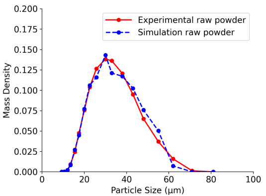
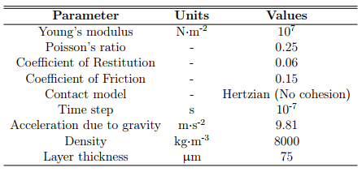

# laserBeamFoam-based LPBF Simulation

This tutorial (`LPBF_small/`) demonstrates the use of `laserBeamFoam` for
simulating a Laser Powder Bed Fusion (LPBF) process. It replicates the setup
presented by Parivendhan et al. (2023) [1].

---

## 📚 Overview of LPBF

Laser Powder Bed Fusion (LPBF) is an additive manufacturing process in which a
laser selectively melts and fuses metal powder in a layer-by-layer manner.
Compared to conventional manufacturing techniques, LPBF offers advantages
such as rapid prototyping, the production of geometrically complex components,
and reduced lead times. However, the melt pool dynamics occur over extremely
short temporal and spatial scales, making experimental observation difficult.
Validated numerical models provide a means to analyse these phenomena and aid
in the development of process–structure–property relationships for consistent,
high-quality manufacturing.

---

## 🧩 Modelling Approach

This tutorial case models the LPBF process using a two-stage approach:

1. **Particle Deposition** – Simulated using the Discrete Element Method (DEM)
to capture particle interactions.
2. **Laser-Induced Melting** – Simulated using `laserBeamFoam` to model
melting, flow, and solidification of metal particles under laser irradiation.

A one-way coupled CFD–DEM framework is employed, in which `laserBeamFoam` uses
the powder bed morphology generated by the DEM simulation. Particle
entrainment by the vapour plume is not considered. The simulation is set up
for stainless steel **SS316L** powder.

---

## 🔹 Powder Deposition Using DEM

The powder deposition process in LPBF involves random and stochastic particle
packing. To represent the powder bed accurately, it is modelled as a
collection of discrete particles rather than a continuous medium. Particle
motion due to interactions with the recoating mechanism and neighbouring
particles is resolved using **LIGGGHTS®** [2], an open-source Discrete Element
Method solver.

In this tutorial, a rain deposition method is used to generate the powder bed.
Particles are introduced at the top of a domain with rigid boundaries and
allowed to settle under gravity onto the build plate. A monodisperse particle
size distribution is used, selected to reflect the experimentally measured
distribution for SS316L powder.

The particle size distribution is shown below [1]:



The contact model properties used in the coating simulation are provided in
the table below [1]:



---

## 🧱 Powder Bed Generation with LIGGGHTS®

The powder bed used in this tutorial has already been generated
using **LIGGGHTS®**. Therefore, **it is not necessary to regenerate it to
run the case as provided**.

However, for users interested in reproducing or modifying the powder
deposition process, the necessary input files and scripts are included in the
`DEM_small/` directory.

We provide here a brief overview to help users get started, but **this is not
a complete installation or usage guide**. For full instructions and advanced
configuration options, please refer to the official LIGGGHTS® documentation:

[LIGGGHTS® Manual and Installation Guide](https://www.cfdem.com/media/DEM/docu/Manual.html)

### 🔧 Installing LIGGGHTS® (Basic Setup)

```bash
# Install required dependencies
sudo apt update
sudo apt install -y build-essential cmake gfortran git \
  libfftw3-dev libjpeg-dev libpng-dev libvtk6-dev \
  libopenmpi-dev openmpi-bin
  
# Clone the LIGGGHTS repository
git clone https://github.com/CFDEMproject/LIGGGHTS-PUBLIC.git
cd LIGGGHTS-PUBLIC/src

# Compile the solver
make auto
```

---

### ▶️ Running the DEM Simulation (Optional)

The characteristics of the particles in the powder bed are defined in the file:

```
DEM_small/input.liggghts
```

To generate the powder bed, run the following script:

```bash
cd DEM_small
./Allrun
```

This will execute the DEM simulation using LIGGGHTS® and produce the file:

```
DEM_small/post/location
```

This file contains the particle positions and must be copied to the `constant/`
directory of the OpenFOAM case before running `laserBeamFoam`:

```bash
cp DEM_small/post/location LPBF_small/constant/
```

---

## 📖 References

[1] G. Parivendhan, J. Paul, and A. J. King, “A numerical study of processing
parameters and their effect on the melt-track profile in Laser Powder Bed
Fusion processes,” *Additive Manufacturing*, vol. 67, p. 103482, Apr. 2023.
[https://doi.org/10.1016/j.addma.2023.103482](https://doi.org/10.1016/j.addma.2023.103482)

[2] C. Kloss, C. Goniva, A. Hager, S. Amberger, and S. Pirker, “Models,
algorithms and validation for opensource DEM and CFD–DEM,” *Progress in
Computational Fluid Dynamics*, vol. 12, no. 2/3, pp. 140–152, 2012.
 [https://doi.org/10.1504/PCFD.2012.047457](https://doi.org/10.1504/PCFD.2012.047457)
